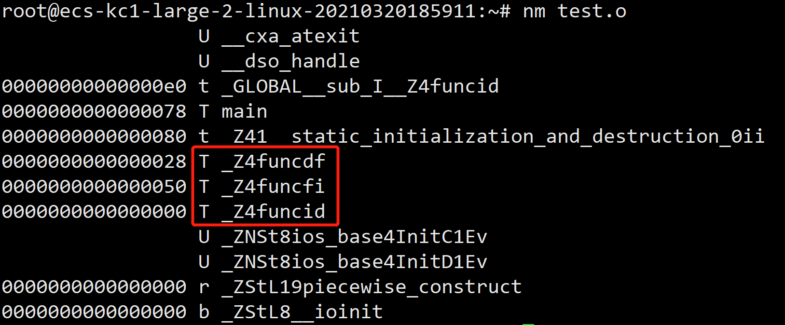
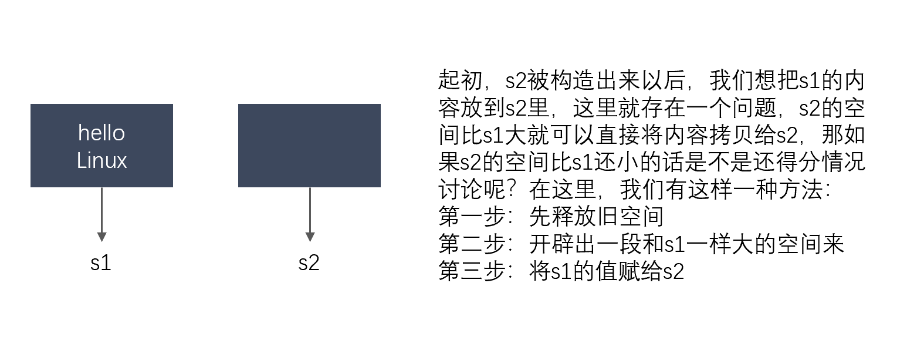
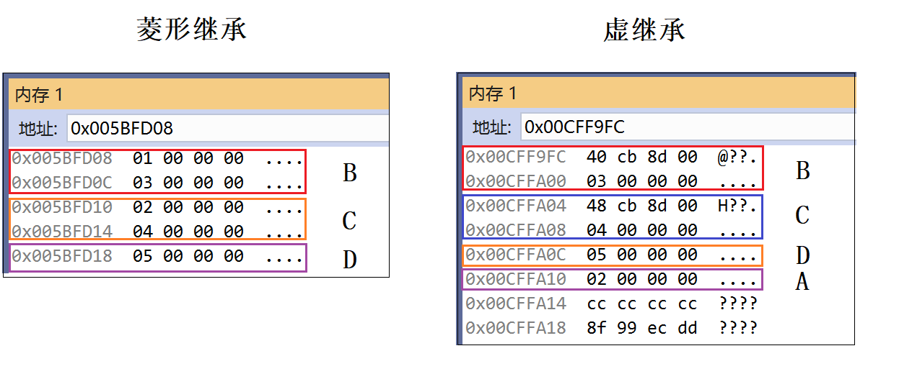
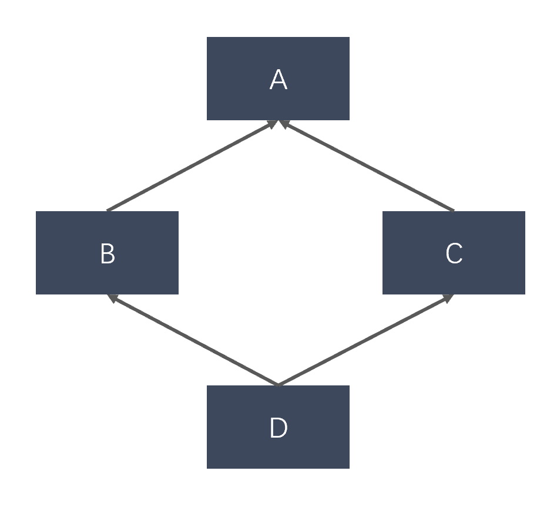

### 1.3 面向对象

#### 1.3.1 简述一下什么是面向对象

面向对象是一种编程思想，把一切东西看成是一个个对象，比如人、耳机、鼠标、水杯等，他们各自都有属性，比如：耳机是白色的，鼠标是黑色的，水杯是圆柱形的等等，把这些对象拥有的属性变量和操作这些属性变量的函数打包成一个类来表示

面向过程和面向对象的区别

- 面向过程：根据业务逻辑从上到下写代码

- 面向对象：将数据与函数绑定到一起，进行封装，这样能够更快速的开发程序，减少了重复代码的重写过程

#### 1.3.2 简述一下面向对象的三大特征

面向对象的三大特征是**封装、继承、多态**。

- **封装：**将数据和操作数据的方法进行有机结合，隐藏对象的属性和实现细节，仅对外公开接口来和对象进行 交互。使用protected/private把成员封装起来，开放一些共有的成员函数对成员合理的访问。

- **继承：**可以使用现有类的所有功能，并在无需重新编写原来的类的情况下对这些功能进行扩展。
    - 三种继承方式

| 继承方式            | private继承     | protected继承     | public继承                   |
| :------------------ | :-------------- | :---------------- | :--------------------------- |
| 基类的private成员   | 不可见          | 不可见            | 不可见                       |
| 基类的protected成员 | 变为private成员 | 仍为protected成员 | 仍为protected成员            |
| 基类的public成员    | 变为private成员 | 变为protected成员 | 仍为public成员仍为public成员 |

- **多态：**用基类指针指向其派生类的实例，然后通过基类指针调用实际派生类的成员函数。实现多态，有二种方式，重写，重载。

#### 1.3.3 简述一下 C++ 的重载和重写，以及它们的区别

**重写**：派生类中存在重新定义的函数，其函数名，参数列表，返回值类型，所有都必须同基类中被重写的函数一致，**只有函数体不同（花括号内）**。派生类对象调用时会调用派生类的重写函数，不会调用被重写函数。重写的基类中被重写的函数必须有**virtual**修饰。

示例如下：

```c++
#include<bits/stdc++.h>
using namespace std;

class A {
public:
    virtual void fun() { cout << "A";}
};

class B :public A {
public:
    virtual void fun() { cout << "B";}
};

int main() {
    A* a = new B();
    a->fun();
    //输出B，A类中的fun在B类中重写
}
```

**重载**：用一个函数名定义多个函数，即所谓的**函数重载**，指同一可访问区内被声明的几个具有不同参数列（参数的类型，个数，顺序不同）的同名函数，根据参数列表确定调用哪个函数，**重载不关心函数返回类型**。

```c++
#include<bits/stdc++.h>
using namespace std;
class A {
	void fun() {};
    void fun(int i) {};
    void fun(int i, int j) {};
    void fun1(int i,int j){};
};
```

#### 1.3.4 说说 C++ 的重载和重写是如何实现的

C++利用**命名倾轧（name mangling）**技术，来改名函数名，区分参数不同的同名函数。

**命名倾轧是在编译阶段完成的。**

C++定义同名重载函数：

```c++
#include<iostream>
using namespace std;

int func(int a, double b) { return ((a)+(b)); }
int func(double a, float b) { return ((a)+(b)); }
int func(float a, int b) { return ((a)+(b)); } 
```



由上图可知，d代表double，f代表float，i代表int，加上参数首字母以区分同名函数。

在基类的函数前加上virtual关键字，在派生类中重写该函数，**运行时将会根据对象的实际类型来调用相应的函数**。如果对象类型是派生类，就调用派生类的函数；如果对象类型是基类，就调用基类的函数。

1. 用virtual关键字申明的函数叫做虚函数，虚函数肯定是类的成员函数。
2. 存在虚函数的类都有一个一维的虚函数表叫做虚表，类的对象有一个指向虚表开始的虚指针。虚表是和类对应的，虚表指针是和对象对应的。
3. 多态性是一个接口多种实现，是面向对象的核心，分为类的多态性和函数的多态性。
4. 重写用虚函数来实现，结合动态绑定。
5. 纯虚函数是虚函数再加上 = 0，派生类必须要实现纯虚函数。
6. 抽象类是指包括至少一个纯虚函数的类。

**纯虚函数**：`virtual void fun()=0`。即抽象类必须在子类实现这个函数，即先有名称，没有内容，在派生类实现内容。

#### 1.3.5 说说 C 语言如何实现 C++ 语言中的重载

c语言中不允许有同名函数，因为编译时函数命名是一样的，不像c++会添加参数类型和返回类型作为函数编译后的名称，进而实现重载。

如果要用c语言显现函数重载，可通过以下方式来实现：

1. 使用函数指针来实现，重载的函数不能使用同名称，只是类似的实现了函数重载功能
2. 重载函数使用可变参数，方式如打开文件open函数
3. gcc有内置函数，程序使用编译函数可以实现函数重载

示例如下：

```c++
#include<stdio.h>

void func_int(void * a) {
    printf("%d\n",*(int*)a);  //输出int类型，注意 void * 转化为int 
}

void func_double(void * b) { 
    printf("%.2f\n",*(double*)b);
}

typedef void (*ptr)(void *);  //typedef申明一个函数指针

void c_func(ptr p, void *param) { 
    p(param); //调用对应函数 
}

int main() {
    int a = 23;
    double b = 23.23;
    c_func(func_int, &a);
    c_func(func_double, &b);
    return 0;
}
```

#### 1.3.6 说说构造函数有几种，分别什么作用

C++中的构造函数可以分为4类：**默认构造函数**、**初始化构造函数**、**拷贝构造函数**、**移动构造函数**。

1. 默认构造函数和初始化构造函数：在定义类的对象的时候，完成对象的初始化工作。

    ```c++
    class Student { 
    public:  
        //默认构造函数
        Student() { num = 1001; age = 18;}
        //初始化构造函数
        Student(int n, int a):num(n),age(a){}
    private:
        int num;
        int age;
    };
    int main() {
        //用默认构造函数初始化对象S1
        Student s1;
        //用初始化构造函数初始化对象S2
        Student s2(1002, 18);
        return 0;
    }
    ```

    当定义有参的构造函数，编译器就不提供默认的构造函数。

2. 拷贝构造函数

    ```c++
    #include "stdafx.h"
    #include "iostream.h"
    class Test {
        int i;
        int *p;
    public:
        Test(int ai, int value) {
            i = ai;
            p = new int(value);
        }
        ~Test() {
            delete p;
        }
        Test(const Test& t){
            this->i = t.i;
            this->p = new int(*t.p);
        }
    };
    //复制构造函数用于复制本类的对象
    int main() {
        
        Test t1(1,2);
        Test t2(t1);  //将对象t1复制给t2。注意复制和赋值的概念不同
    
        return 0;
    }
    ```

    赋值构造函数默认实现的是值拷贝（浅拷贝）。

3. 移动构造函数。用于将其他类型的变量，隐式转换为本类对象。下面的转换构造函数，将int类型的r转换为Student类型的对象，对象的age为r，num为1004.

    ```c++
    Student(int r) {  
        int num = 1004;
        int age = r;
    }
    ```

#### 1.3.7 只定义析构函数，会自动生成哪些构造函数

只定义析构函数，编译器将自动生成**拷贝构造函数**和**默认构造函数**。

#### 1.3.8 一个类，默认会生成哪些函数

定义一个空类

```c++
class Empty{};
```

默认会生成以下几个函数

1. **无参构造函数**

在定义类的对象的时候，完成对象的初始化工作。

```c++
Empty(){}
```

2. 拷贝构造函数

拷贝构造函数用于**复制本类的对象**

```c++
Empty(const Empty& copy){}
```

3. 赋值运算符

```c++
Empty& operator = (const Empty& copy){}
```

4. 析构函数（非虚）

```c++
~Empty(){}
```

#### 1.3.9 说说 C++ 类对象的初始化顺序，有多重继承情况下的顺序

1. 创建派生类的对象，**基类的构造函数优先被调用**（也优先于派生类里的成员类）；

2. 如果类里面有成员类，**成员类的构造函数优先被调用**；(也优先于该类本身的构造函数）

3. 基类构造函数如果有多个基类，则**构造函数的调用顺序是某类在类派生表中出现的顺序而不是它们在成员初始化表中的顺序**；

4. 成员类对象构造函数如果有多个成员类对象，则**构造函数的调用顺序是对象在类中被声明的顺序而不是它们出现在成员初始化表中的顺序**；

5. 派生类构造函数，作为一般规则派生类构造函数应该不能直接向一个基类数据成员赋值而是把值传递给适当的基类构造函数，否则两个类的实现变成**紧耦合的（tightly coupled）**将更加难于正确地修改或扩展基类的实现。（基类设计者的责任是提供一组适当的基类构造函数）

6. 综上可以得出，初始化顺序：

    **基类构造函数–>成员类对象构造函数–>自身构造函数**

    其中成员变量的初始化与声明顺序有关，构造函数的调用顺序是类派生列表中的顺序。

    析构顺序和构造顺序相反。

#### 1.3.10 向上转型和向下转型

1. **派生类转换为基类**：向上转型，使用`dynamic_cast<type_id>(expression)`，这种转换相对来说比较安全不会有数据的丢失；
2. **基类转换为派生类**：向下转型，可以使用强制转换，这种转换时不安全的，会导致数据的丢失，原因是基类的指针或者引用的内存中可能不包含派生类的成员的内存。

#### 1.3.11 深拷贝和浅拷贝，如何实现深拷贝

1. **浅拷贝（值拷贝）：**将源对象的值拷贝到目标对象中去，源对象和目标对象共用一份实体，只是所引用的变量名不同，地址还是相同的。
2. **深拷贝**：先申请和源对象大小相同的空间，将源对象里的内容拷贝到目标对象中，两个指针指向不同的内存位置。深拷贝情况下，不会出现重复释放同一块内存的错误。

**深拷贝的实现：**

```c++
// 深拷贝的拷贝构造函数
STRING(const STRING& s)
{
    //_str = s._str;
    _str = new char[strlen(s._str) + 1];
    strcpy_s( _str, strlen(s._str) + 1, s._str);
}

// 赋值运算符的重载
STRING& operator=(const STRING& s)
{
    if (this != &s) {
        //this->_str = s._str;
        delete[] _str;
        this->_str = new char[strlen(s._str) + 1];
        strcpy_s(this->_str, strlen(s._str) + 1, s._str);
    }
    return *this;
}
```



解决指针悬挂问题，通过不断的开空间让不同的指针指向不同的内存，以防止同一块内存被释放两次的问题。

#### 1.3.12 C++ 中的多态

**派生类重写基类方法，用基类引用指向派生类对象，调用方法时候会进行动态绑定，这就是多态**。

**多态：静态多态+动态多态**

- **静态多态（函数重载）：**编译器在编译期间完成的，根据实参类型推断调用哪个函数，如果有对应的函数，就调用，没有则在编译时报错。

```c++
int Add(int a,int b) {
    return a + b;
}

char Add(char a,char b) {
    return a + b;
}

int main() {
    cout << Add(666, 888) << endl;
    cout << Add('1', '2'); 
    return 0;
}
```

- **动态多态（函数重写）：**要实现动态多态，满足**动态绑定条件**：
    - 基类中必须有虚函数，在派生类中必须重写虚函数。
    - 通过基类类型的指针或引用来调用虚函数。

```c++
// 协变是重写的特例
// 基类中, 返回值是基类类型的引用或指针
// 派生类中, 返回值为派生类类型的引用或指针。

class Base {
public:
    virtual Base* FunTest() {
        cout << "victory" << endl;
        return this;
    }
};

class Derived :public Base {
public:
    virtual Derived* FunTest() {
        cout << "yeah" << endl;
        return this;
    }
};

int main() {
    Base b;
    Derived d;

    b.FunTest();
    d.FunTest();

    return 0;
}
```

#### 1.3.13 为什么要虚析构，为什么不能虚构造

1. **虚析构：**将可能会被继承的基类析构函数设置为虚函数，保证在new一个派生类时，在使用基类指针指向该派生类对象，释放基类指针时可以释放掉派生类的空间，**防止内存泄漏**。

    如果基类的析构函数不是虚函数，**在特定情况下会导致派生类无法被析构**：

    1. 用派生类指针绑定派生类实例，析构的时候，不管基类析构函数是不是虚函数，都会正常析构。
    2. 用基类指针绑定派生类实例，析构的时候，如果基类析构函数不是虚函数，则只会析构基类，不会析构派生类对象，从而造成内存泄漏。

    **C++默认的析构函数不是虚函数是因为虚函数需要额外的虚函数表和虚表指针，占用额外的内存。**对于不会被继承的类来说，其析构函数如果是虚函数，就会浪费内存。

2. **不能虚构造：**

    1. **存储空间：**虚函数对应一个虚表，这个表的地址是存储在对象的内存空间的。如果将构造函数设置为虚函数，就需要到虚表中调用，可是对象还没有实例化，没有内存空间分配，如何调用。（悖论，先有鸡还是先有蛋）
    2. **使用：**虚函数主要用于在信息不全的情况下，能使重写的函数得到对应的调用。构造函数本身就是要初始化实例，则使用虚函数没有实际意义。虚函数的作用在于通过基类指针或者引用来调用它的时候能够变成调用派生类的那个成员函数。而构造函数是在创建对象时自动调用的，不可能通过基类指针或者引用去调用，因此也就规定构造函数不能是虚函数。
    3. **实现**：虚表在构造函数调用后才建立，因而构造函数不可能成为虚函数。
    4. **实际含义**：调用构造函数时不能确定对象的真实类型（因为派生类会调父类的构造函数），构造函数的作用是提供初始化，在对象生命期只执行一次，不是对象的动态行为，也没有太大的必要成为虚函数。

#### 1.3.14 模板类是在什么时候实现的

1. **模板实例化**：

    - **显示实例化**：显示定义模板应该用什么类型去生成具体的类或函数。
    - **隐式实例化**：在编译的过程中由编译器来决定使用什么类型来实例化一个模板。

    不管是显示实例化或隐式实例化，**最终生成的类或函数完全是按照模板的定义来实现的。**

2. **模板具体化**：当模板实例化后生成的类或函数不能满足需要时，可以对模板进行具体化。具体化时可以修改原模板的定义，当使用该类型时，按照具体化后的定义实现，**具体化相当于对某种类型进行特殊处理**。

3. 代码示例：

    ```c++
    // #1 模板定义
    template<class T>
    struct TemplateStruct
    {
        TemplateStruct() {
            cout << sizeof(T) << endl;
        }
    };
    
    // #2 模板显示实例化
    template struct TemplateStruct<int>;
    
    // #3 模板具体化
    template<> struct TemplateStruct<double> {
        TemplateStruct() {
            cout << "--8--" << endl;
        }
    };
    
    int main() {
        TemplateStruct<int> intStruct;
        TemplateStruct<double> doubleStruct;
    
        // #4 模板隐式实例化
        TemplateStruct<char> llStruct;
    }
    
    // 结果
    4
    --8--
    1
    ```

    #### 1.3.15 说说类继承时，派生类对不同关键字修饰的基类方法的访问权限

    类中的成员可以分为三种类型，分别为public成员、protected成员、public成员。

    类中可以直接访问自己类的public、protected、private成员，但类对象只能访问自己类的public成员。

    1. public继承：派生类可以访问基类的public、protected成员，不可以访问基类的private成员； 派生类对象可以访问基类的public成员，不可以访问基类的protected、private成员。
    2. protected继承：派生类可以访问基类的public、protected成员，不可以访问基类的private成员； 派生类对象不可以访问基类的public、protected、private成员。
    3. private继承：派生类可以访问基类的public、protected成员，不可以访问基类的private成员； 派生类对象不可以访问基类的public、protected、private成员。

    #### 1.3.16 简述一下移动构造函数，什么库用到了这个函数？

    C++11中新增移动构造函数。

    与拷贝类似，移动也使用一个对象的值设置另一个对象的值，但移动实现的是对象值真实的转移（源对象到目的对象）：源对象将丢失其内容，其内容将被目的对象占有。

    移动操作的发生的时候，是当移动值的对象是未命名的对象的时候。**这里未命名的对象就是那些临时变量，甚至都不会有名称**。典型的未命名对象就是函数的返回值或者类型转换的对象。使用临时对象的值初始化另一个对象值，不会要求对对象的复制：因为临时对象不会有其它使用，因而，它的值可以被移动到目的对象。

    做到这些，就要使用**移动构造函数和移动赋值**：当使用一个临时变量对对象进行构造初始化的时候，调用移动构造函数。类似的，**使用未命名的变量的值赋给一个对象时，调用移动赋值操作**。

    移动操作的概念对对象管理它们使用的存储空间很有用的，诸如对象使用new和delete分配内存的时候。在这类对象中，拷贝和移动是不同的操作：**从A拷贝到B意味着，B分配了新内存，A的整个内容被拷贝到为B分配的新内存上。 而从A移动到B意味着分配给A的内存转移给了B，没有分配新的内存，它仅仅包含简单地拷贝指针。** 

    ```c++
    // 移动构造函数和赋值
    class Example6 {
        string* ptr;
    public:
        Example6 (const string& str) : ptr(new string(str)) {}
        ~Example6 () {delete ptr;}
        // 移动构造函数，参数x不能是const Pointer&& x，
        // 因为要改变x的成员数据的值；
        // C++98不支持，C++0x（C++11）支持
        Example6 (Example6&& x) : ptr(x.ptr) {
            x.ptr = nullptr;
        }
        // move assignment
        Example6& operator= (Example6&& x) {
            delete ptr; 
            ptr = x.ptr;
            x.ptr = nullptr;
            return *this;
        }
        // access content:
        const string& content() const {return *ptr;}
        // addition:
        Example6 operator+(const Example6& rhs) {
            return Example6(content()+rhs.content());
        }
    };
    
    int main () {
        Example6 foo("Exam");           // 构造函数
        // Example6 bar = Example6("ple"); // 拷贝构造函数
        Example6 bar(move(foo));     // 移动构造函数
                                    // 调用move之后，foo变为一个右值引用变量，
                                    // 此时，foo所指向的字符串已经被"掏空"，
                                    // 所以此时不能再调用foo
        bar = bar + bar;            // 移动赋值，在这儿"="号右边的加法操作，
                                    // 产生一个临时值，即一个右值
                                     // 所以此时调用移动赋值语句
        cout << "foo's content: " << foo.content() << '\n';
        return 0;
    }
    
    // 执行结果
    foo's content: Example
    ```

#### 1.3.17 C++ 类内可以定义引用数据成员吗？

可以，但要遵循三个规则：

1. 不能用默认构造函数初始化，必须提供构造函数来初始化引用成员变量，否则会造成**引用未初始化错误**。
2. 构造函数的**形参也必须是引用类型**。
3. **不能在构造函数里初始化，必须在初始化列表中进行初始化**。

#### 1.3.19 什么是常函数，有什么作用

类的成员函数后加 const，表明这个函数不会对这个类对象的数据成员（非静态数据成员）作任何改变。

设计类的时候，一个原则就是**对于不改变数据成员的成员函数都要在后面加const，而对于改变数据成员的成员函数不能加 const**。

常量（即 const）对象可调用 const 成员函数，而不能调用非const修饰的函数。

```c++
class CStu {
public:
    int a;
    CStu() {
        a = 12;
    }
 
    void Show() const {
        //a = 13; //常函数不能修改数据成员
        cout << a << "I am show()" << endl;
    }
};
int main() {
    CStu st;
    st.Show();
    return 0;
}
```

#### 1.3.20 虚继承，解决什么问题，如何实现？

解决C++**多重继承**问题的一种手段。

**多重继承：**从不同途径继承同一基类，会在派生类中存在多份拷贝。这将存在两个问题：

- 浪费存储空间
- 存在二义性：通常可以将派生类对象的地址赋值给基类对象，实现的具体方式是，将基类指针指向派生类（派生类有基类的拷贝）中的基类对象的地址，但是多重继承可能存在一个基类的多份拷贝，这就出现了二义性。

```c++
class A {
public:
    int _a;
};
class B :virtual public A {
public:
    int _b;
};
class C :virtual public A {
public:
    int _c;
};
class D :public B, public C {
public:
    int _d;
};

//菱形继承和菱形虚继承的对象模型
int main() {
    D d;
    d.B::_a = 1;
    d.C::_a = 2;
    d._b = 3;
    d._c = 4;
    d._d = 5;
    cout << sizeof(D) << endl;
    return 0;
}
```

分别从菱形继承和虚继承来分析：



菱形继承中，A在B，C，D中各有一份，虚继承中，A共享。

上面的虚继承表实际上是一个指针数组。B、C实际上是虚基表指针，指向虚基表。

- 虚基表：存放相对偏移量，用来找虚基类

#### 1.3.21 虚函数和纯虚函数实现原理

虚函数主要实现**多态机制**。

**多态**：用基类指针指向其派生类实例，通过基类指针调用实际派生类的成员函数。

- 可以让基类指针有“多种形态”，这是一种泛型技术。
- 若调用非虚函数，则无论实际对象是什么类型，都执行基类类型所定义的函数。非虚函数总是在编译时根据调用该函数的对象，引用或指针的类型而确定。
- 若调用虚函数，则直到运行时才能确定调用哪个函数，运行的虚函数是引用所绑定或指针所指向的对象所属类型定义的版本。

虚函数必须是基类的非静态成员函数，作用是**实现动态联编**，在程序运行阶段动态选择合适的成员函数。

定义虚函数后，可在派生类中对虚函数重新定义，重新定义的函数应与虚函数具有相同的形参个数和类型，以实现统一的接口，不同定义过程。如果在派生类中没有对虚函数重新定义，则它继承其基类的虚函数。

**虚函数（Virtual Function）**通过一张虚函数表（Virtual Table，V-Table）实现。

虚表是一个类的虚函数地址表，解决继承、覆盖的问题。当用基类指针操作一个派生类的时候，这张虚函数表指明实际所应该调用的函数。

```c++
class Person {
public:
    virtual void GetName() {
        cout<<"PersonName:xiaosi"<<endl;
    };
};
class Student :public Person {
public:
    void GetName() {
        cout << "StudentName:xiaosi" << endl;
    };
};
int main(){
    Person *person = new Student();
    //基类调用子类的函数
    person->GetName(); //StudentName:xiaosi
}
```

**纯虚函数**在基类中没有定义实现方法，要求派生类必须定义自己的实现过程。

实现纯虚函数是在函数原型后加：`virtualvoid GetName() =0`。

含有纯虚函数的类称为**抽象类**，无法生成对象，其目的是使派生类仅仅继承函数的接口。

必须在派生类中重新声明函数（不要后面的＝0），否则该派生类也无法实例化，而且它们在抽象类中往往没有定义。

```c++
class Person {
public:
    //纯虚函数
    virtual void GetName() = 0;
};
class Student :public Person {
public:
    Student(){};
    void GetName() {
        cout << "StudentName:xiaosi" << endl;
    };
};
int main() {
    Student student;
}
```

#### 1.3.22 说说纯虚函数能实例化吗，为什么？派生类要实现吗，为什么？

1. 纯虚函数无法实例化，但其派生类可以实例化。

    ```c++
    class Base {
    public:
        virtual void func() = 0;
    };
    ```

    ```c++
    class Base {
    public:
        virtual void func() = 0;
    };
    class Derived :public Base {
    public:
        void func() override {
            cout << "哈哈" << endl;
        }
    };
    int main() {
        Base *b = new Derived();
        b->func();
        return 0;
    }
    ```

2. 虚函数采用虚表。类中含有纯虚函数时，其虚表不完全，有个空位。即，纯虚函数在类的虚表中对应的表项被赋值为0，也就是指向一个不存在的函数。

    **由于编译器绝对不允许有调用一个不存在的函数的可能，所以该类不能生成对象。**在它的派生类中，除非重写此函数，否则也不能生成对象。

#### 1.3.24 说说 C++ 中什么是菱形继承问题，如何解决

**菱形继承问题：**



类B和类C，都继承类A，同时还有类D通过多重继承机制继承类B和类C。因为上述图表的形状类似于菱形，因此这个问题被形象地称为菱形继承问题。

```c++
class Animal { // 基类 
public:
    int weight;
    int getWeight() { return weight; }
};
class Tiger :public Animal {};
class Lion :public Animal {};
class Liger :public Tiger, public Lion {}
```

上面代码中，Animal类对应于最顶层类（图表中的A），Tiger和Lion分别对应于图表的B和C，Liger类（狮虎兽，即老虎和狮子的杂交种)对应于D。

```c++
int main() {
    Liger lg;   /*编译错误，下面的代码不会被任何C++编译器通过 */
    int weight = lg.getWeight();
}
```

在继承结构中，Tiger类和Lion类都继承自Animal基类，有个问题：因为Liger类多重继承了Tiger类和Lion类，因此Liger类会有两份Animal类的成员（数据和方法），**Liger对象"lg"会包含Animal基类的两个子对象。**

当调用"`lg.getWeight()`"将会导致一个编译错误，这是因为编译器并不知道是调用Tiger类的`getWeight()`还是调用Lion类的`getWeight()`。所以，调用getWeight方法是不明确的，因此不能通过编译。

**解决方案：**如果Lion类和Tiger类在分别继承Animal类时都用virtual来标注，对于每一个Liger类对象，C++会保证只有一个Animal类的子对象会被创建。

```c++
class Tiger :virtual public Animal {};
class Lion :virtual public Animal {};
```

唯一的变化就是在Tiger类和Lion类的声明中增加了`"virtual`"关键字。现在类Liger对象将会只有一个Animal子对象，下面的代码编译正常:

```c++
int main() {
    Liger lg;
    int weight = lg.getWeight();
}
```

#### 1.3.25 请问构造函数中的能不能调用虚方法

不要在构造函数中调用虚方法，语法上讲调用没有问题，但是从效果上看，往往不能达到需要的目的。

派生类对象构造期间进入基类的构造函数时，对象类型变成了基类类型，而不是派生类类型。

同样，进入基类析构函数时，对象也是基类类型。

所以，虚函数始终仅仅调用基类的虚函数（如果是基类调用虚函数），不能达到多态的效果，所以放在构造函数中是没有意义的，而且往往不能达到本来想要的效果。

#### 1.3.26 请问拷贝构造函数的参数是什么传递方式，为什么

1. 拷贝构造函数的参数使用**引用传递**。
2. 如果拷贝构造函数中的参数不是一个引用，即形如`CClass(const CClass c_class)`，就相当于**采用传值方式(pass-by-value)**，而传值方式会调用该类的拷贝构造函数，**从而造成无穷递归地调用拷贝构造函数**。

注意**传指针其实也是传值**，如果上面的拷贝构造函数写成`CClass(const CClass* c_class)`，也是不行的。事实上，**只有传引用不是传值外，其他所有的传递方式都是传值**。

#### 1.3.27 类方法和数据的权限有哪几种

1. C++通过 public、protected、private 三个关键字来控制成员变量和成员函数的访问权限，它们分别表示公有的、受保护的、私有的，被称为**成员访问限定符**。

    | 关键字    | 权限                           |
    | :-------- | :----------------------------- |
    | public    | 可以被任意实体访问             |
    | protected | 只允许子类及本类的成员函数访问 |
    | private   | 只允许本类的成员函数访问       |

2. 下面介绍一个例子。

    基类：

    ```c++
    class Person {
    public:
        Person(const string& name, int age) : m_name(name), m_age(age){}
        void ShowInfo(){
            cout << "姓名：" << m_name << endl;
            cout << "年龄：" << m_age << endl;
        }
    protected:
        string m_name;  //姓名
    private:
        int m_age;  //年龄
    };
    ```

    派生类：

    ```c++
    class Teacher : public Person {
    public:
        Teacher(const string& name, int age, const string& title)
             : Person(name, age), m_title(title) {}
    
        void ShowTeacherInfo() {
            ShowInfo();        //正确，public属性子类可见
            cout << "姓名：" << m_name << endl;  //正确，protected属性子类可见
            cout << "年龄：" << m_age << endl;   //错误，private属性子类不可见
    
            cout << "职称：" << m_title << endl;   //正确，本类中可见自己的所有成员
        }
        
    private:
        string  m_title;        //职称
    };
    ```

    调用方：

    ```c++
    void test(){
        Person person("张三", 22);
        person.ShowInfo();                  //public属性,对外部可见
        cout << person.m_name << endl;      //protected属性,对外部不可见
        cout << person.m_age << endl;       //private属性,对外部不可见
    }
    ```

#### 1.3.29 什么是多态？除了虚函数，还有什么方式能实现多态？

1. 多态是面向对象的重要特性之一，它是一种行为的封装，就是**不同对象对同一行为会有不同的状态**。

2. 多态是**以封装和继承为基础的**。在C++中多态分为**静态多态（早绑定）和动态多态（晚绑定）**两种，其中动态多态是通过虚函数实现，静态多态通过函数重载实现。

    ```c++
    class A {
    public:    
        void do(int a);    
        void do(int a, int b);
    };
    ```

#### 1.3.30 简述一下虚析构函数，什么作用

1. 虚析构函数，是将基类的析构函数声明为virtual。

    ```c++
    class TimeKeeper {
    public:    
        TimeKeeper() {}        
        virtual ~TimeKeeper() {}    
    };
    ```

2. 虚析构函数的主要作用是**防止内存泄露**。

    定义一个基类的指针p，在delete p时，如果基类的析构函数是虚函数，这时只会看p所赋值的对象，如果p赋值的对象是派生类的对象，就会调用派生类的析构函数（毫无疑问，在这之前也会先调用基类的构造函数，在调用派生类的构造函数，然后调用派生类的析构函数，基类的析构函数，所谓先构造的后释放）；

    **如果p赋值的对象是基类的对象，就会调用基类的析构函数，这样就不会造成内存泄露。**

    如果基类的析构函数不是虚函数，在`delete p`时，调用析构函数时，只会看指针的数据类型，而不会去看赋值的对象，这样就会造成内存泄露。

创建一个TimeKeeper基类和一些及其它的派生类作为不同的计时方法

```c++
class TimeKeeper {
public:
    TimeKeeper() {}
    ~TimeKeeper() {}  //非virtual的
};

//都继承与TimeKeeper
class AtomicClock :public TimeKeeper{};
class WaterClock :public TimeKeeper{};
class WristWatch :public TimeKeeper{};
```

如果客户想要在程序中使用时间，不想操作时间如何计算等细节，这时候我们可以设计factory（工厂）函数，让函数返回指针指向一个计时对象。

该函数返回一个基类指针，这个基类指针是指向于派生类对象的：

```c++
TimeKeeper* getTimeKeeper() {
    //返回一个指针，指向一个TimeKeeper派生类的动态分配对象
}
```

因为函数返回的对象存在于堆中，因此为了**在不使用时需要使用释放该对象（delete）**

```c++
TimeKeeper* ptk = getTimeKeeper();
delete ptk;
```

此处基类的析构函数是非virtual的，因此**通过一个基类指针删除派生类对象是错误的**

**解决办法：** 将基类的析构函数改为virtual就正确了

```c++
class TimeKeeper {
public:
    TimeKeeper() {}
    virtual ~TimeKeeper() {}
};
```

声明为virtual之后，通过**基类指针删除派生类对象就会释放整个对象（基类+派生类）**

#### 1.3.31 说说什么是虚基类，可否被实例化？

1. 在被继承的类前面加上virtual关键字，这时被继承的类称为虚基类，代码如下：

    ```c++
    class A
    class B1 :public virtual A;
    class B2 :public virtual A;
    class D :public B1, public B2;
    ```

2. 虚继承的类可以被实例化，举例如下：

    ```c++
    class Animal {};
    class Tiger : virtual public Animal {};
    class Lion : virtual public Animal {}
    
    int main() {
        Liger lg;
    
        /*既然我们已经在Tiger类和Lion类的定义中声明了"virtual"关键字，于是下面的代码编译OK */
        int weight = lg.getWeight();
    }
    ```

#### 1.3.32 拷贝赋值和移动赋值

1. 拷贝赋值通过**拷贝构造函数来赋值**，创建对象时，使用同一类中之前创建的对象来初始化新创建的对象。

2. 移动赋值是通过**移动构造函数来赋值**，二者的主要区别在于

    1）拷贝构造函数的形参是一个左值引用，而移动构造函数的形参是一个右值引用；

    2）拷贝构造函数完成的是整个对象或变量的拷贝，而移动构造函数是生成一个指针指向源对象或变量的地址，接管源对象的内存，相对于大量数据的拷贝节省时间和内存空间。

#### 1.3.33 仿函数了解吗？有什么作用

1. **仿函数（functor）又称为函数对象（function object）**，是一个能行使函数功能的类。

    仿函数的语法与普通函数调用一样，不过作为仿函数的类，**必须重载`operator()`运算符**，举个例子：

```c++
class Func {
public:
    void operator() (const string& str) const {
        cout<<str<<endl;
    }
};

Func myFunc;
myFunc("helloworld!");

// 输出
helloworld!
```

**仿函数**既能像普通函数一样传入给定数量的参数，还能存储或处理更多有用信息。

假设有一个`vector<string>`，需要统计长度小于5的`string`的个数：

```c++
 bool LengthIsLessThanFive(const string& str) {
     return str.length() < 5;    
 }
 int res = count_if(vec.begin(), vec.end(), LengthIsLessThanFive);
```

其中，`count_if`函数的第三个参数是一个函数指针，返回一个bool类型的值。

将特定的阈值长度传入：

```c++
 bool LenthIsLessThan(const string& str, int len) {
     return str.length() < len;
 }
```

这个函数看起来比前面一个版本更具有一般性，但是他不能满足`count_if`函数的参数要求：`count_if`要求的是`unary function`（仅带有一个参数）作为它的最后一个参数。

如果我们使用仿函数，就可以解决这个问题：

```c++
 class ShorterThan {
 public:
     explicit ShorterThan(int maxLength) : length(maxLength) {}
     bool operator() (const string& str) const {
         return str.length() < length;
     }
 private:
     const int length;
 };
```

#### 1.3.34 C++ 中哪些函数不能被声明为虚函数？

- **普通函数（非成员函数）**：只能被重载（overload），不能被重写（override），声明为虚函数也没有什么意思，因此编译器会在编译时绑定函数。

- **静态成员函数**：静态成员函数对每个类来说只有一份代码，所有的对象都共享这一份代码，没有要动态绑定的必要性。静态成员函数属于一个类而非某一对象，没有this指针，**无法进行对象的判别**。

- **内联成员函数**：内联函数在编译时被展开，虚函数在运行时才能动态的绑定函数。

    内联函数是在编译时期展开,而虚函数的特性是运行时才动态联编,所以两者矛盾,不能定义内联函数为虚函数

- **构造函数**：构造函数的目的是为了明确初始化对象成员才产生的，然而`virtual function`主要为了在不完全了解细节的情况下也能正确处理对象。另外，虚函数是对不同类型的对象产生不同的动作，如果对象还没有产生，则无法使用虚函数来完成想要的动作。

- **友元函数**：因为C++不支持友元函数的继承，**对于没有继承特性的函数没有虚函数的说法**。

#### 1.3.35 类模板和模板类的区别

- **类模板**：模板的定义，不是一个实实在在的类，定义中用到通用类型参数。

- **模板类**：真实存在的类定义，是类模板的实例化。类定义中参数被实际类型所代替。

1. 类模板的类型参数可以有一个或多个，每个类型前面都必须加`class`，如`template <class T1, class T2>class someclass{…};`在定义对象时分别代入实际的类型名，如  `someclass<int,double> obj;`
2. 和使用类一样，使用类模板时要注意其作用域，只能在其有效作用域内用它定义对象。
3. 模板可以有层次，一个类模板可以作为基类，产生派生模板类。

#### 1.3.36 虚函数表里存放的内容是什么时候写进去的？

1. 虚函数表是一个存储虚函数地址的数组，以NULL结尾。**虚表（vftable）在编译阶段生成**，对象内存空间开辟以后，写入对象中的 vfptr，然后调用构造函数。即：**虚表在构造函数之前写入**。
2. 除了在构造函数之前写入之外，还需要考虑到**虚表的二次写入机制**，通过此机制让每个对象的虚表指针都能准确的指向到自己类的虚表，为实现动多态提供支持。
