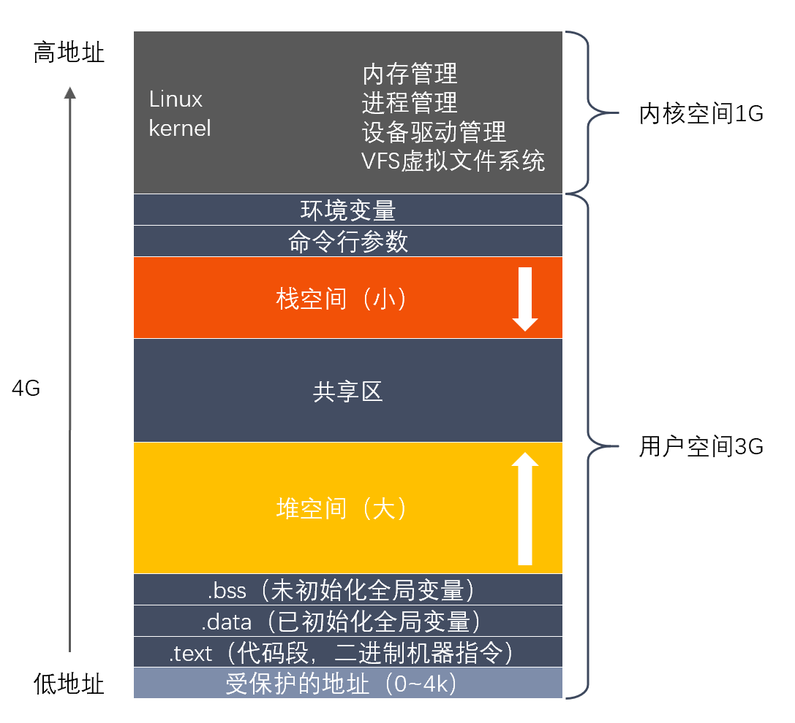

### 1.2 C++内存

#### 1.2.1 简述一下堆和栈的区别

1. **堆栈空间分配不同**。栈由操作系统自动分配释放 ，存放函数的参数值，局部变量的值等；堆一般由程序员分配释放。
2. **堆栈缓存方式不同**。栈使用的是一级缓存， 它们通常都是被调用时处于存储空间中，调用完毕立即释放；堆则是存放在二级缓存中，速度要慢些。
3. **堆栈数据结构不同**。堆类似数组结构；栈类似栈结构，先进后出。

#### 1.2.2 简述C++的内存管理

1. **内存分配方式**：

在C++中，内存分成5个区，他们分别是**堆**、**栈**、**自由存储区**、**全局/静态存储区**和**常量存储区**。

- **全局/静态存储区域：**存全局变量，静态变量。程序编译时内存已分配好，并存在于程序整个运行期间，程序结束后由系统统一释放
    - 全局变量和静态变量被分配到同一块内存中。
        - C 语言中，全局变量又分为初始化的和未初始化的。初始化的全局变量和静态变量在一块区域，未初始化的全局变量与静态变量在相邻的另一块区域。同时未被初始化的对象存储区可以通过 void* 来访问和操纵，程序结束后由系统自行释放。
        - 在 C++ 里面没有区分，他们共同占用同一块内存区。
- **栈：**存放函数的参数值，局部变量，函数执行结束时会被自动释放。栈内存分配运算内置于处理器的指令集中，效率高，但是容量有限。
- **堆（动态内存分配）：**通过new和malloc由低到高分配，由delete或free手动释放或者程序结束自动释放。动态内存的生存期人为决定，使用灵活。缺点是容易分配/释放不当容易造成内存泄漏，频繁分配/释放会产生大量内存碎片。 若程序员不释放，程序结束时可能由OS（操作系统）回收
- **字符/文字常量区：** 存放常量字符串，程序结束时由系统释放
- **程序代码区：** 存放函数体的二进制代码

2. **常见的内存错误及其对策**：

**错误：**

（1）内存分配未成功，却使用了它。

（2）内存分配虽然成功，但是尚未初始化就引用它。

（3）内存分配成功并且已经初始化，但操作越过了内存的边界。

（4）忘记了释放内存，造成内存泄露。

（5）释放了内存却继续使用它。

**对策：**

（1）定义指针时，先初始化为NULL。

（2）用malloc或new申请内存之后，应该**立即检查**指针值是否为NULL。防止使用指针值为NULL的内存。

（3）不要忘记为数组和动态内存**赋初值**。防止将未被初始化的内存作为右值使用。

（4）避免数字或指针的下标**越界**，特别要当心发生“多1”或者“少1”操作

（5）动态内存的申请与释放必须配对，防止**内存泄漏**

（6）用free或delete释放了内存之后，立即将指针**设置为NULL**，防止“野指针”

（7）使用智能指针。

3. **内存泄露及解决办法**：

**什么是内存泄露？**

简单地说就是申请了一块内存空间，使用完毕后没有释放掉。

（1）new和malloc申请资源使用后，没有用delete和free释放；

（2）子类继承父类时，父类析构函数不是虚函数。

（3）Windows句柄资源使用后没有释放。

**怎么检测？**

第一：良好的编码习惯，使用了内存分配的函数，一旦使用完毕，要记得使用其相应的函数释放掉。

第二：将分配的内存的指针以链表的形式自行管理，使用完毕之后从链表中删除，程序结束时可检查改链表。

第三：使用智能指针。

第四：一些常见的工具插件，如ccmalloc、Dmalloc、Leaky、Valgrind等等。

#### 1.2.3 malloc和局部变量分配在堆还是栈？

- malloc是在**堆上分配内存**，需要程序员自己回收内存；

- 局部变量是在**栈中分配内存**，超过作用域就自动回收。

#### 1.2.4 程序有哪些section，分别的作用？程序启动的过程？怎么判断数据分配在栈上还是堆上？

